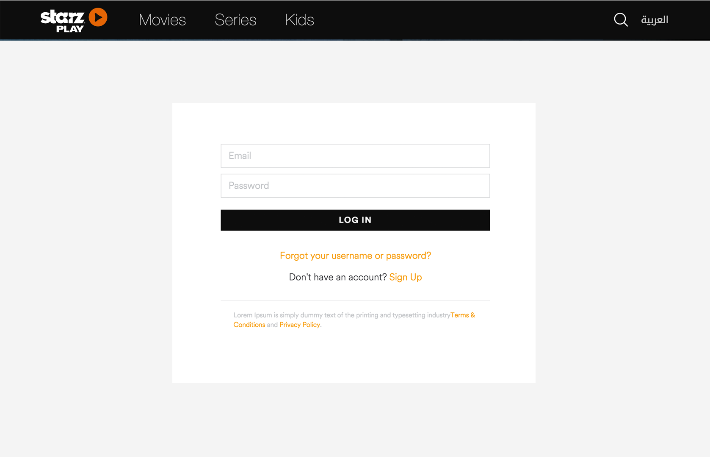
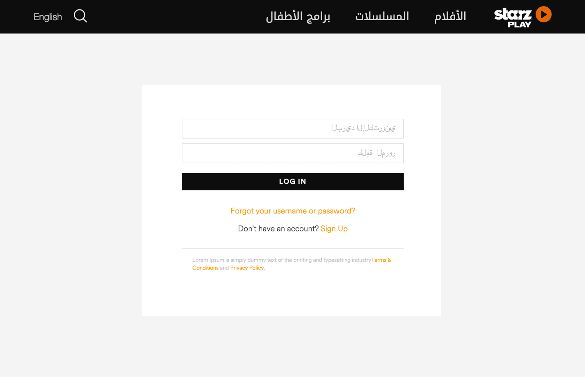

#StarzPlay Javascript developer

We'd like to see some of your skills as a JS developer but we don't want you to invest more than 6 hours doing this.
We prefer you to send us something partial than receiving nothing, so don't worry if you can't complete all the steps
and send us what you achieve. If you see you cannot do it please make a plan and send it to us.

##Dependencies
1. Github account
2. NodeJS installed

##Exercise
1. Clone this repository
2. There is a index.html form.
3. Add validation to the next fields:
	3.1. fullName is required
	3.2- email is required and should be a right email
	3.3- password is required
4. Submit button should be disabled while fields are not valid.
5. Add styles to make the form follow the same style guide shown in the pictures below (Please include the header in the html too).

6. As we work with english and arabic languages, make the page work well in both directions.
7. Add a new Route in the server.js file to print the submitted field of the form with JSON format.
8. Send us a pull request with your solution.

Feel free to use the libraries that you feel more comfortable with and modify the code as much as you like.
